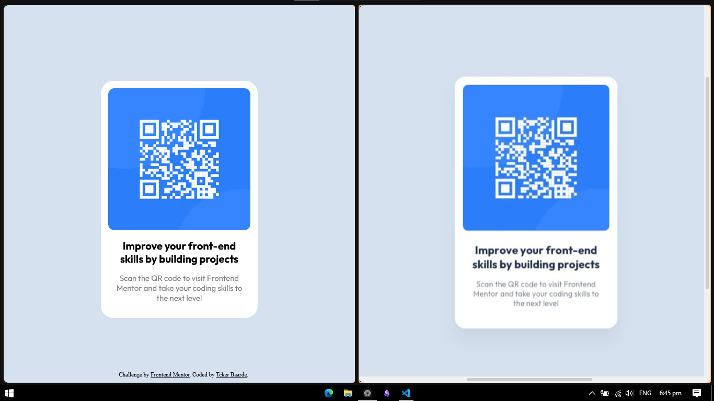
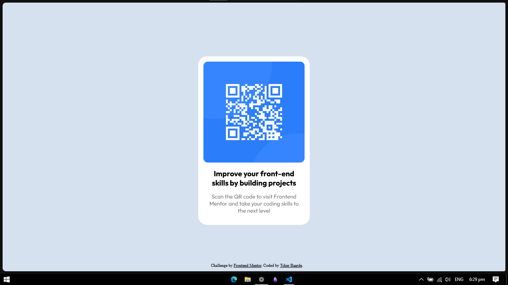

# Frontend Mentor - QR code component solution

This is a solution to the [QR code component challenge on Frontend Mentor](https://www.frontendmentor.io/challenges/qr-code-component-iux_sIO_H). Frontend Mentor challenges help you improve your coding skills by building realistic projects. 

## Table of contents

- [Overview](#overview)
  - [Screenshot](#screenshot)
  - [Links](#links)
- [My process](#my-process)
  - [Built with](#built-with)
  - [What I learned](#what-i-learned)
  - [Continued development](#continued-development)
  - [Useful resources](#useful-resources)
- [Author](#author)
- [Acknowledgments](#acknowledgments)

## Overview

### Screenshot




### Links

- Solution URL: [Free Code Camp](https://www.freecodecamp.org/news/learn-css-basics-by-building-a-card-component/)

## My process

### Built with

- HTML
- CSS

**Note: These are just examples. Delete this note and replace the list above with your own choices**

### What I learned

By just the division tags how they make the certain parts of the component

```
<div id="">
  <div class="">
    
    <div class="">
    </div>
  </div>
</div>
```

### Continued development

I want it to improve my CSS skills since I feel like I'm more of a backend rather than a front-end type of developer

### Useful resources

- [Free Code Camp](https://www.freecodecamp.org/news/learn-css-basics-by-building-a-card-component/) - This helped me for build the component. Just following the pattern of the division tags or what we call **"div"** tags and after that just modify the component like the preview shown from the front-end mentor

## Author

- Website - [Tcker](https://github.com/tcker)
- Frontend Mentor - None

## Acknowledgments

I  just loved it help me make the site and also strictly following my own rule **NO GPT RULE**

